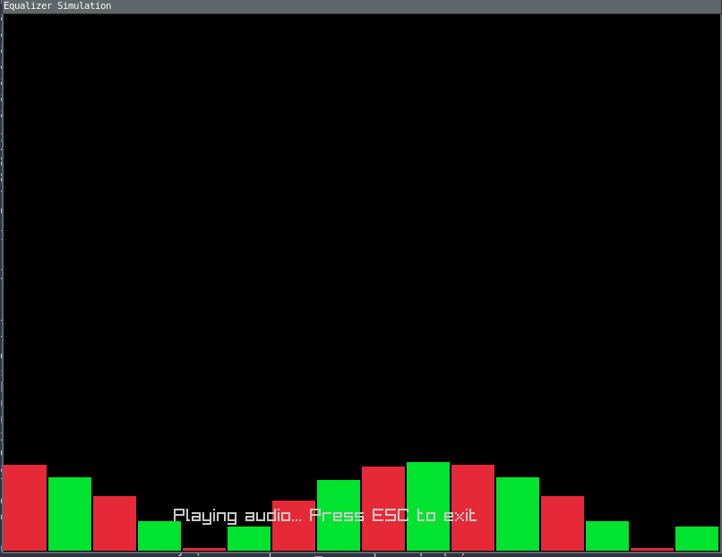

# <Give me name already!>

For now, not named project, visualising music, like old good Windows Media Player.
Like it was primary school :)

I will try to achieve some equalizer vibe app, with nice customizable colors, animation speed and so on.

# Screen

    

# Name propositions

- MPEQualizer - MP are my initials
- Musicer
- MusicPOL (:) if you know, you know)
- SonicWave
- SoundSurgeon

